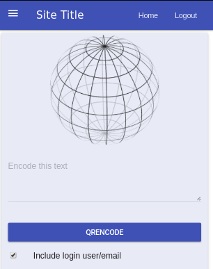
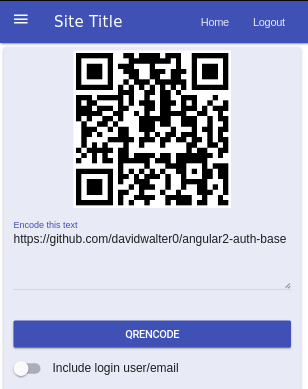

---
## Screen captures of example

Toggle include user info to include the user's login name and email
from authentication application.



Example qr code generated



--- 
*Authenticated vs Unauthenticated*

Basic config of the base app on connect unauthenticated empty page is
presented. Once authenticated the application authenticated component
is activated.

Connect to qr code generator, allow multiple lines of input

Testing with golang qrcode service. The initial tests were standalone
instances on a dev system.

---
## Run the app

---
*Connect to a qr generator*


Calls a running qr generator

The one this has been tested with can be configured briefly like the following

```
go get github.com/davidwalter0/go-qr-generator

export QRCODE_GENERATOR_HOST=bind-ip
export QRCODE_GENERATOR_PORT=port
go run go-qr-generator

```

Edit ../../environments/environment.ts and set the environment variables
to match the config option for the qr code backend

```
    export const environment = {
        production: false,
        QRCODE_GENERATOR_HOST: "192.168.0.3",
        QRCODE_GENERATOR_PORT: "8081",
    };
```

Then run the angular application via ng

```
    ng serve 
```
