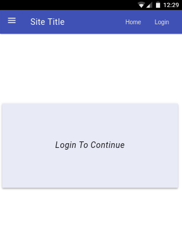
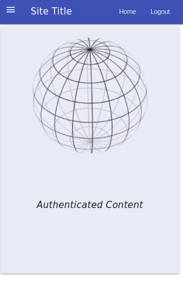

---
## Screen captures of example

Unauthenticated application



Authenticated application.



--- 
*Authenticated vs Unauthenticated*

Basic config of the base app on connect unauthenticated empty page is
presented. Once authenticated the application authenticated component
is activated.


```
    git clone github.com/davidwalter0/angular2-auth-base
    cd angular2-auth-base
    ng serve 
```

---
---

*Miscellany*

- The facebook config implementation wasn't tested
- Exported firebase configuration to firebase.credentials.ts and
  renamed firebaseConfigCredentials
- Add firebase.credentials.ts.empty, rename to firebase.credentials.ts
  and update with the credentials
- Add the firebase.credentials.ts file name to gitignore to keep
  credentials out of git repo
- chmod 600 firebase.credentials.ts


```
export const firebaseConfigCredentials = {
  apiKey: '',
  authDomain: '',
  databaseURL: '',
  storageBucket: '',
  messagingSenderId: ''
};
```


---
## Angular Firebase Authentication

Additional information from an angular2 firebase demo


Check out a demo here: [Angular Authentication Example](https://coursetro.com/preview/angular-auth-demo/)

Read (and watch) the tutorial here: [Angular Authentication Tutorial](https://coursetro.com/posts/code/32/Create-a-Full-Angular-Authentication-System-with-Firebase)

Clone this repo to get up and running! Check out more [Angular Tutorials](https://coursetro.com) at our site.
