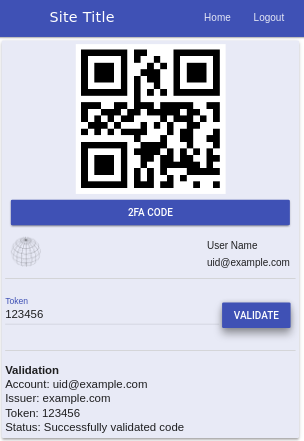

---
## Screen captures of example

Toggle include user info to include the user's login name and email
from authentication application.


Example 2FA Validation (fake QRCode)



--- 
*Authenticated vs Unauthenticated*

Basic config of the base app on connect unauthenticated empty page is
presented. Once authenticated the application authenticated component
is activated.

Connect to qr code generator, allow multiple lines of input

Testing with golang qrcode service. The initial tests were standalone
instances on a dev system.

---
## Run the app

---
*Connect to a qr generator*


Calls a running qr generator

The one this has been tested with can be configured briefly like the following

```
    go get github.com/davidwalter0/twofactor
    # Replace example.com with your issuer
    # Use tls/configured service with letsencrypt certs
    export APP_HTTPS=true
    export APP_HOST=example.com
    export APP_PORT=8443
    export APP_CERT=/etc/letsencrypt/live/example.com/cert.pem
    export APP_KEY=/etc/letsencrypt/live/example.com/privkey.pem
    sudo -E /usr/local/go/bin/go run serve.go

```

Then run the angular application via ng

```
    git clone github.com/davidwalter0/angular2-qrcode
    cd angular2-qrcode
```


Edit src/environments/environment.ts and set the environment variables
to match the config option for the qr code backend

```
    export const environment = {
        production: false,
        TESTING: false,
        HTTPS: true,
        ISSUER: "example.com",
        QRCODE_GENERATOR_HOST: "192.168.0.3",
        QRCODE_GENERATOR_PORT: "8081",
    };
```

```
    npm install --save
    ng serve 
```
